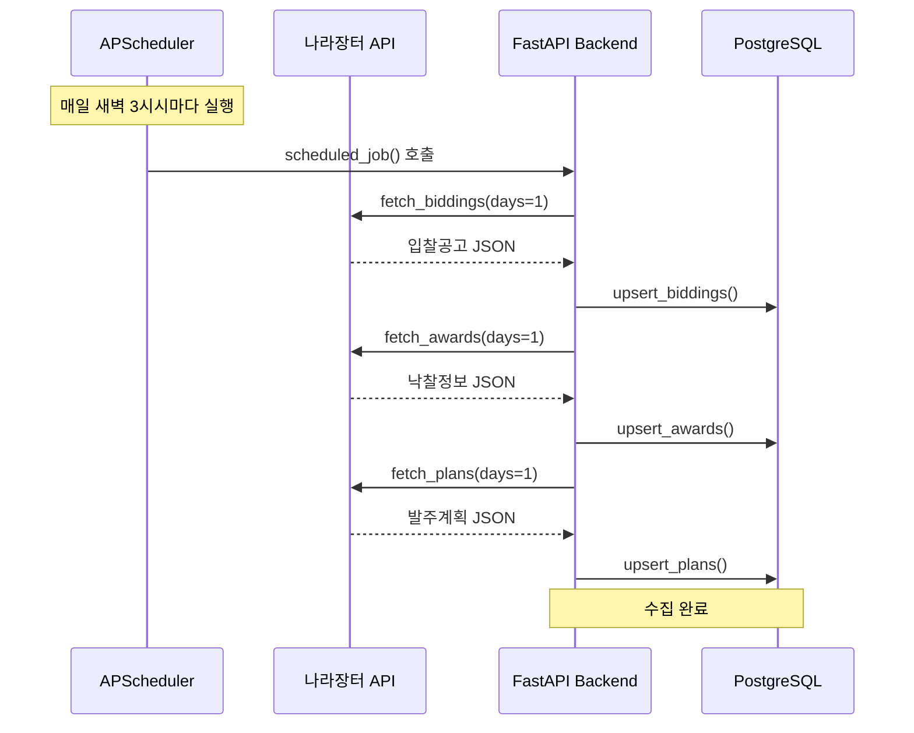
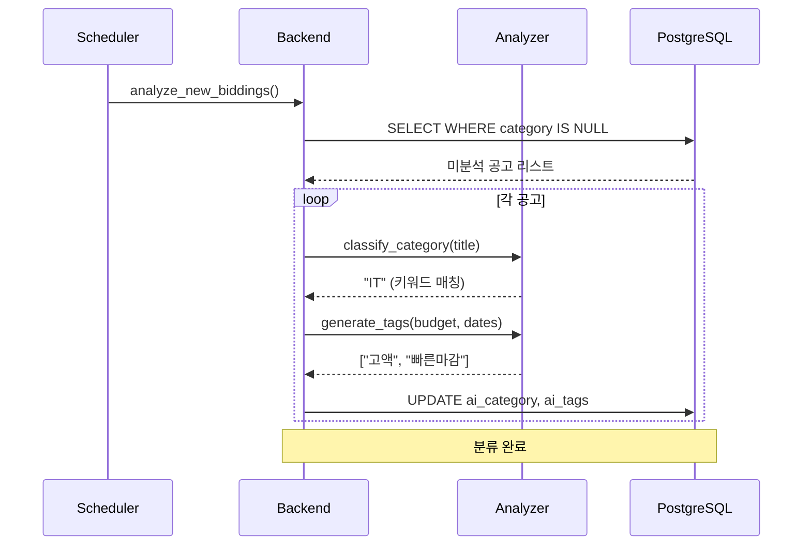
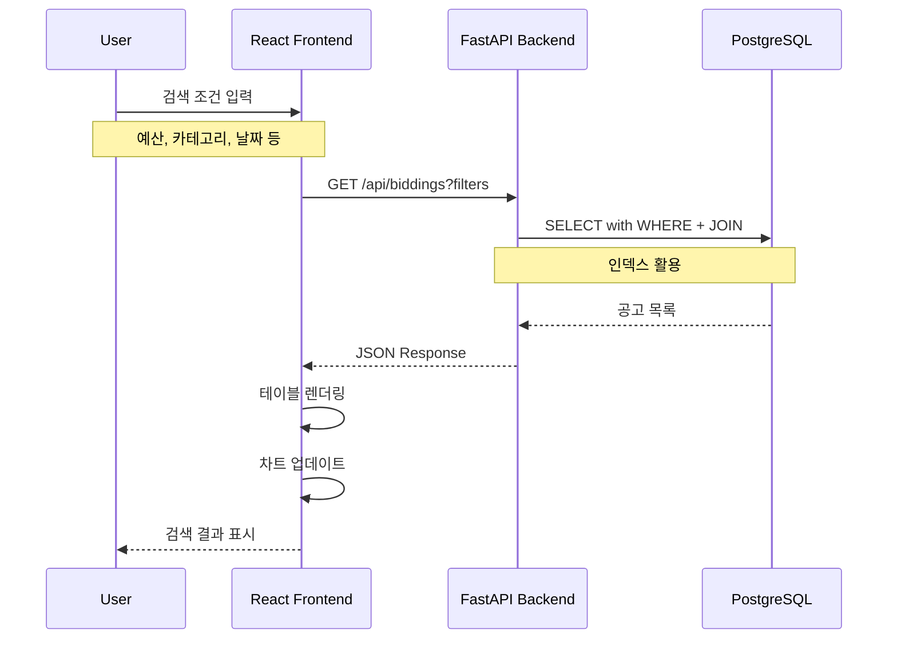

# 🏛️ 나라장터 Plus - 입찰공고 모니터링 플랫폼

<details>
<summary> 📌 프로젝트 개요 </summary>
<br>
  
**프로젝트 기간** 2025.10 ~ 2025.12  
<br>

본 프로젝트는 **나라장터(G2B) 공공데이터 API**를 활용한 **입찰공고 모니터링 및 분석 플랫폼**입니다.<br>
기존 나라장터의 제한적인 필터링, 분류 시스템 부재 문제를 해결하기 위해 개발되었습니다.<br>
**1일 간격 자동 수집**, **키워드 기반 자동 분류** 및 **맥락 인식 태그 생성**으로 효율적인 정보 탐색을 지원합니다. 

</details>

<details>
  <summary>🚀 주요 기능 </summary>

- **데이터 수집**: 1일마다 입찰공고/낙찰정보/발주계획 자동 수집 <br><br>
- **스마트 분류 시스템**: 공고 제목 키워드 분석으로 10개 카테고리(IT, 건설, 용역 등) 자동 분류 <br><br>
- **맥락 기반 태그**: 예산(고액/중액/소액), 긴급성(긴급/빠른마감), 유형(유지보수/신규사업/재공고) 자동 생성 <br><br>
- **고급 검색 필터**: 예산 범위, 날짜 범위, 카테고리, 검색어 등 다양한 조합 지원 <br><br>
- **데이터 시각화**: 최근 30일 입찰 건수 추이, 카테고리별 분포, 인기 태그 차트 제공 <br><br>
- **유사 공고 추천**: TF-IDF 벡터화 및 코사인 유사도 기반 관련 공고 추천

</details>

<details>
  <summary> ⚠️ 개발 과정에서 해결한 문제</summary>

- **데이터 타입 불일치**: API가 예산을 float로 반환하나 DB는 BigInteger, float → int 변환 로직 추가 <br><br>
- **중복 데이터 처리**: 빈번한 수집으로 중복 발생 가능, PostgreSQL ON CONFLICT (Upsert 패턴) 적용 <br><br>
  
</details>

<details>
  <summary> 🧪 기술적 성과</summary>

- **Full Stack 개발**: React + FastAPI 기반 웹 애플리케이션 구축 <br><br>
- **공공 API 연동**: 나라장터 Open API 페이지네이션 처리 및 데이터 ETL <br><br>
- **자동화 시스템**: APScheduler 기반 백그라운드 데이터 수집 자동화 <br><br>
- **데이터 분석**: 키워드 기반 분류, TF-IDF 유사도 분석 구현 <br><br>

</details>

---

# 🛠 기술 스택

<details>
  <summary> 🔗 기술 스택 </summary>

  본 프로젝트는 **Python 3.12** 기반으로 개발되었으며,  
  백엔드 API, 데이터 수집/분석, 프론트엔드 UI로 구성되었습니다.

  ### 🖥️ Frontend
- **React 19.2** — UI 프레임워크, SPA 구성
- **Material-UI (MUI)** — 컴포넌트 라이브러리, 반응형 디자인
- **Chart.js** — 라인/바/도넛 차트 시각화
- **Axios** — HTTP 클라이언트, API 통신
- **React Router** — 페이지 라우팅
- **dayjs** — 날짜 포맷팅 및 계산

### ⚙️ Backend (Python)
- **FastAPI** — 비동기 REST API 프레임워크, 자동 문서화(Swagger/ReDoc)
- **SQLAlchemy** — ORM, 쿼리 빌더, 마이그레이션 관리
- **Pydantic** — 요청/응답 스키마 검증, 타입 안전성
- **APScheduler** — 백그라운드 스케줄링
- **httpx** — 비동기 HTTP 클라이언트(외부 API 연동)
- **loguru** — 구조적 로깅
- **python-dotenv** — 환경변수 관리

### 📊 데이터 분석 (Python)
- **scikit-learn** — TF-IDF 벡터화, 코사인 유사도 계산
- **pandas** — 데이터프레임 처리
- **NumPy** — 수치 연산, 배열 처리

### 🗄️ Database
- **PostgreSQL 15** — 관계형 데이터베이스(AWS RDS)
- **Unique Constraint** — notice_number 기반 중복 방지
- **Index** — ai_category, notice_date 등 검색 최적화

### 🐳 Infrastructure
- **Docker** — 백엔드 컨테이너화, 환경 격리
- **Vercel** — 프론트엔드 자동 배포, CDN
- **AWS RDS** — PostgreSQL 호스팅

</details>

# 📊 시스템 아키텍처

<details>
  <summary>데이터 수집 플로우</summary>



</details>

<details>
  <summary>자동 분류 및 태그 생성 플로우</summary>



</details>

<details>
  <summary>사용자 검색 및 필터링 플로우</summary>


</details>

# 📁 프로젝트 구조

<details>
<summary> 📂 파일 구조 </summary>

```text
g2b_project/
├── g2b/                          # 🐍 Backend (FastAPI)
│   ├── app.py                    # FastAPI 엔트리포인트
│   ├── database.py               # PostgreSQL 연결 관리
│   ├── models.py                 # SQLAlchemy ORM 모델
│   ├── schemas.py                # Pydantic 스키마
│   ├── config.py                 # 환경변수 설정
│   ├── scheduler.py              # 자동 수집 스케줄러
│   ├── analyzer.py               # 분류 및 태그 로직
│   │
│   ├── apis/                     # 🔌 G2B API 연동
│   │   ├── bidding_api.py        # 입찰공고 수집
│   │   ├── award_api.py          # 낙찰정보 수집
│   │   ├── orderplan_api.py      # 발주계획 수집
│   │   └── main.py               # 전체 수집 오케스트레이션
│   │
│   └── routers/                  # 🛣️ REST API 라우터
│       ├── biddings.py           # 입찰공고 API
│       ├── awards.py             # 낙찰정보 API
│       ├── orderplans.py         # 발주계획 API
│       ├── statistics.py         # 통계 API
│       └── analysis.py           # 분류 분석 API
│
├── g2b_frontend/                 # ⚛️ Frontend (React)
│   └── src/
│       ├── pages/
│       │   └── Dashboard.jsx     # 메인 대시보드
│       ├── components/
│       │   ├── filters/          # 검색 필터 컴포넌트
│       │   ├── tables/           # 데이터 테이블
│       │   ├── charts/           # 차트 시각화
│       │   └── modals/           # 상세 정보 모달
│       └── services/
│           └── api.js            # Backend API 호출
│
├── requirements.txt              # Python 의존성
├── Dockerfile                    # Docker 이미지 설정
└── README.md
</details>
